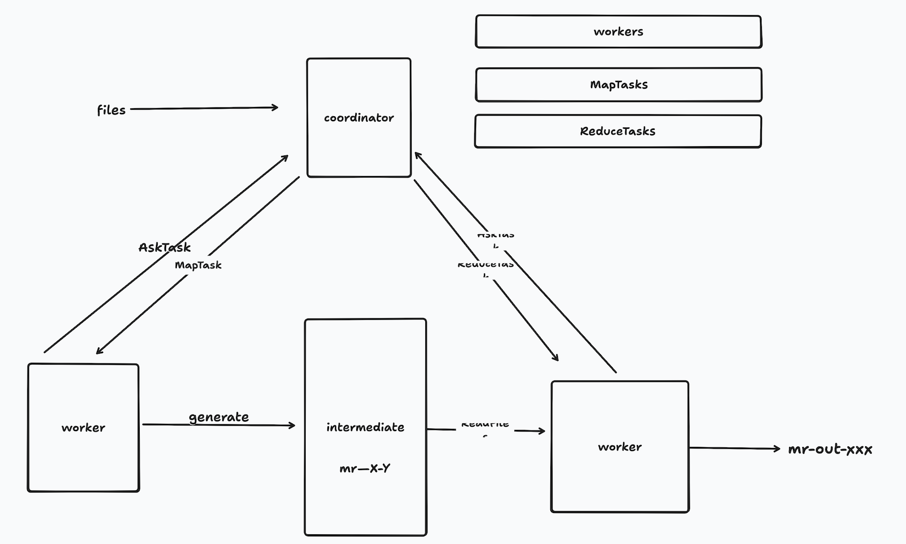
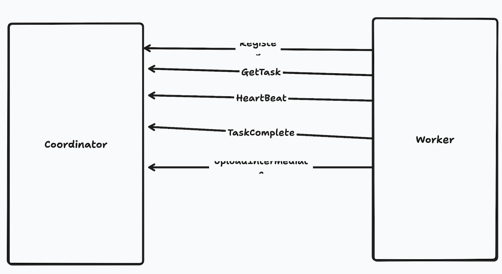
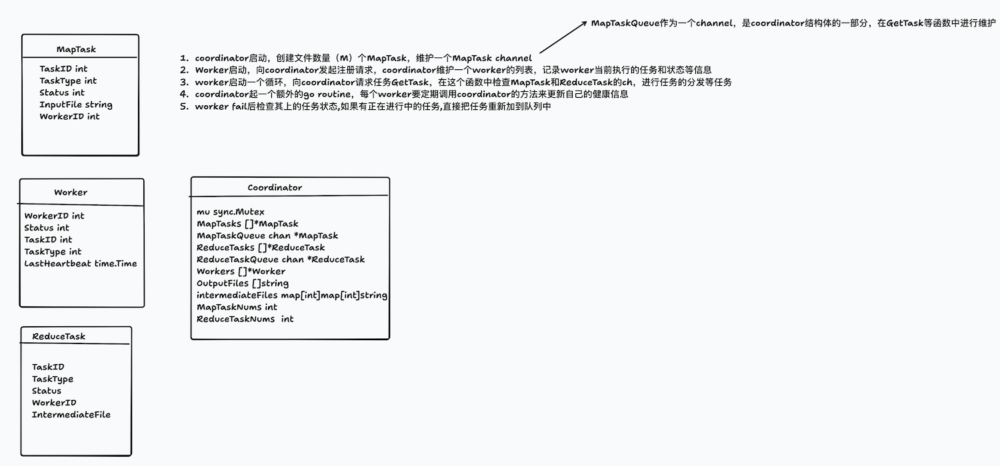

## MapReduce 简介

MapReduce是谷歌公司于2004年发布的一个用于处理大量数据集的系统。彼时的谷歌面临着一个巨大的挑战：数据增长速度极快，面对数以TB的数据，由于分布式系统十分复杂，且经常有机器宕机，靠程序员去维护这个庞杂的系统太过困难也太过低效。因此，他们开发了MapReduce系统。

MapReduce系统将数据的处理过程高度抽象，分为Map和Reduce两个阶段。其核心是利用一个KV系统来将数据分发到不同的机器上，存储为中间文件，再将中间文件整合，最终得到结果。

用户在使用该系统时，仅需要提供Map和Reduce两个函数接口，分别对数据进行分割处理和中间文件整合。而系统内部关于分布式系统的容灾，扩容等细节完全对程序员透明，从而节省了开发人员大量的时间精力。

## MapReduce的工作流程

MIT 6.824有一个简要的介绍:[MapReduce](https://pdos.csail.mit.edu/6.824/notes/l01.txt)

MapReduce首先接收一个来自分布式存储系统（如GFS）的大数据集，然后将输入文件划分为若干固定大小的块，每个数据块作为Map的输入。

Map阶段，系统为每个数据块分配一个Map任务，并分发到集群中的一个机器上。执行用户传入的Map函数，对数据进行处理，产生包含一系列键值对的中间文件。

Shuffle阶段，map过程中产生的键值对，会根据key进行hash分组，相同的键的所有值被传送到同一个Reduce任务的机器上。随后，系统对这些文件的键值对按照键值进行排序。

Reduce阶段，调用用户自定义Reduce函数，接收一个键和与该键值匹配的列表，规约为一个完整的结果。

## MIT Lab1 MapReduce

MIT的lab实现的是一个简化的MapReduce，突出表现在输入为单个文件，不需要系统划分为数据块，且所有client在本地运行，不存在真实的网络通信中可能出现的问题。

### 总体架构：



coordinator作为服务器，负责分发Map和Reduce任务。当开始工作后，worker向coordinator注册，并申请任务，worker申请任务时不区分种类，只简单地处理coordinator分发的任务。在Map阶段，worker产生一系列包含键值对的中间文件，命名为mr-X-Y。随后进入Reduce阶段，然后处理输出结果。

整体架构和工作流程较为简单。首先要弄清楚worker和coordinator之间需要的rpc通信函数：



1. Register():worker向coordinator注册自己，coordinator负责维护worker的状态
2. GetTask():worker申请任务，coordinator负责给该特定id的worker分配等待完成的map或者reduce任务
3. HeartBeat():worker定期向coordinator发送心跳，更新自己的状态。当coordinator检测到心跳超时后，将认为该worker已失效，并重新分配该worker上处于进行中的任务。
4. TaskComplete():worker通知coordinator某个任务已经完成，coordinator负责维护任务状态，以及向worker分发新的任务
5. UploadIntermediaFile():worker完成Map任务后产生一系列中间文件，这些文件需要在Reduce阶段告知worker，因此coordinator需要维护这些文件的位置

想清楚rpc通信，接下来需要定义通信所需的参数，基本上都是一些id和状态的传递。

### 具体实现

在具体实现代码前，还需要想清楚需要哪些结构体，每个结构体都需要有哪些字段，以及整个的工作流程。



在实际coding过程中，发现最初的设计有不足之处，再予以不断完善。比如说，coordinator中的Intermediate从最初的map里套map改成了`map[int][]string`，因为刚开始想错了Intermediate的具体存储方式。

在我的设计里，将map和reduce任务分别用了两个字段来维护：一个列表来维护每个任务的状态，一个channel维护待分发的任务队列。这样做的好处是每个任务的状态很清晰，易于维护和更新，任务队列负责任务调度，易于并发，易于实现容错机制（一个任务fail的话直接把状态改为free就会重新被调度）。缺点是数据一致性太差，需要维护两个字段的状态完全一致，而且有一个维护列表的协程开销。

```go
type Coordinator struct {
	mu                sync.Mutex
	MapTask           []*MapTask
	mq                chan *MapTask
	ReduceTask        []*ReduceTask
	rq                chan *ReduceTask
	Workers           []*Workers
	OutputFiles       []string
	IntermediateFiles map[int][]string
	MapPhaseDone      bool
	MapDoneNums       int
	ReducePhaseDone   bool
	ReduceDoneNums    int
	IsDone            chan bool
	nReduce           int
}
```

两个task和worker的定义没什么好说的，无非一些状态信息。

接下来顺着代码的工作流程梳理：

### coordinator

接收输入的文件，创建Map任务，初始化MapTask列表，然后make一些必要的字段。这里的坑是，刚接触go，不清楚哪些需要make哪些不需要，比如说coordinator里的MapTask和mq。

现在总结一下：

1. 三个必须make后再使用的：channel，map，预留容量的slice
2. struct等基本类型，零值可用，所以不用make
3. slice不预留容量的话不需要make，可以直接append

然后启动三个goroutine，分别用来维护map，reduce和检查worker的心跳情况。

maintainMapTask()：起一个死循环，终止条件是coordinator的MapPhaseDone为真。每次循环收集任务列表中的free任务，分发到mq中。等待100ms。这个过程非常简单，值得一提的是为什么先收集free任务然后再分发。因为如果把分发到mq的过程也放到锁里，可能会损失一点性能（虽说不大吧）。

maintainReduceTask()：差不多，但是多了一步当检测到map阶段完成后根据intermediate产生reduce任务的步骤。

checkHealthy：起一个10s的定时器，定时扫描worker列表，如果worker的心跳记录时间距现在超过10s，标记为死亡，重新分配任务。如上所说，简单地找到该worker的状态是进行中的任务标记为free即可。

### worker

首先向coordinator注册自己，得到一个递增的workerID。随后立刻启动hearbeat协程，向coordinator更新状态。然后进入一个无限循环，不断地接收任务并执行。根据任务的类型，worker分别进行：执行任务，sleep后重试，退出。

值得说的是runMap和runReduce这两个函数，重点是中间文件，这点是当初卡住思路的一个重要因素。

---

> runMap

**step1**

调用用户的map函数，得到一个KV列表，大概长这样：

```go
kva = []KeyValue{
    {Key: "apple",  Value: "1"},
    {Key: "banana", Value: "1"},
    {Key: "apple",  Value: "1"},
    {Key: "cherry", Value: "1"},
    {Key: "banana", Value: "1"},
    {Key: "apple",  Value: "1"},
}
```

**step2**

创建临时文件和对应每个文件的json编码器（中间文件用json存，方便reduce阶段读kv）

```go
//create tempfile for nReduce
	tempFiles := make([]*os.File, nReduce) //[file0,file1,file2]
	encoders := make([]*json.Encoder, nReduce)//[encoder0,encoder1,encoder2]
	filenames := make([]string, nReduce) //[name0,name1,name2]

	for i := range nReduce {
		tempFileName := fmt.Sprintf("mr-%d-%d", mapTaskID, i)
		tempFile, err := os.Create(tempFileName)
		if err != nil {
			log.Fatalf("cannot create temp file %v", tempFile)
		}
		tempFiles[i] = tempFile
		encoders[i] = json.NewEncoder(tempFile)
		filenames[i] = tempFileName
	}
```

**step3**

hash分发+encode，这是核心

```go
for _, kv := range kva {
		reduceTaskNum := ihash(kv.Key) % nReduce
		err := encoders[reduceTaskNum].Encode(&kv)
		if err != nil {
			log.Fatalf("cannot encode key-value pair :%v", err)
		}
	}
```

根据kva列表中的每个键值对的键的hash值，模上Reduce Task的个数，把这个键值对分配到对应的文件里。举个例子：

|循环次数|kv|ihash(key)|%3|目标文件|写入内容|
|--- |---|---|---|---|---|
|1|{apple,1}|12345|0|mr-0-0|{"key":"apple","value":"1"}|
|2|{banana,1}|67890|1|mr-0-1|{"key":"banana","value":"1"}|

这里，相同的key总会被分到同一个reduce任务

**step4**

上传文件信息到coordinator：

```go
for i := range 3 {
    ua := UploadIntermediateFileArgs{
        NReduceID: i,          // 告诉 Coordinator 这个文件对应哪个 Reduce Task
        Filename:  filenames[i], // mr-0-0, mr-0-1, mr-0-2
    }
    ur := UploadIntermediateFileReply{}
    call("Coordinator.UploadIntermediateFile", &ua, &ur)
}
```

最后coordinator中的记录为：

```go
c.IntermediateFiles[0] = ["mr-0-0", "mr-1-0", "mr-2-0", ...]  // Reduce Task 0 需要读取的文件
c.IntermediateFiles[1] = ["mr-0-1", "mr-1-1", "mr-2-1", ...]  // Reduce Task 1 需要读取的文件
c.IntermediateFiles[2] = ["mr-0-2", "mr-1-2", "mr-2-2", ...]  // Reduce Task 2 需要读取的文件
```

---

> runReduce

以reduce0为例，他会收到一个列表，包含这他需要处理的文件名：

- mr-0-0 (来自 Map Task 0)
- mr-1-0 (来自 Map Task 1)
- mr-2-0 (来自 Map Task 2)

**step1**

读取并合并所有中间文件

```go
keyValues := make(map[string][]string)

for _, filename := range ["mr-0-0", "mr-1-0", "mr-2-0"] {
    file, err := os.Open(filename)
    decoder := json.NewDecoder(file)
    
    for {
        var kv KeyValue
        err := decoder.Decode(&kv)  // 解码 JSON
        if err != nil {
            break  // 文件读完
        }
        keyValues[kv.Key] = append(keyValues[kv.Key], kv.Value)
    }
    file.Close()
}
```

详细执行过程:

读取 `mr-0-0`:

```json
{"Key":"apple","Value":"1"}
{"Key":"apple","Value":"1"}
{"Key":"apple","Value":"1"}
```

`keyValues["apple"] = ["1", "1", "1"]`

读取 `mr-1-0` (假设也有 apple):

```json
{"Key":"apple","Value":"1"}
{"Key":"apple","Value":"1"}
```

`keyValues["apple"] = ["1", "1", "1", "1", "1"]`

读取 `mr-2-0` (假设也有 apple):

```json
{"Key":"apple","Value":"1"}
```

`keyValues["apple"] = ["1", "1", "1", "1", "1", "1"]`

最终 keyValues:

```go
keyValues = map[string][]string{
    "apple": ["1", "1", "1", "1", "1", "1"],  // 6 个 "1"
}
```

**step2**

排序keys

**step3**

执行reduce并写入输出文件

```go
outputFilename := fmt.Sprintf("mr-out-%d", 0)  // "mr-out-0"
outputFile, err := os.Create(outputFilename)

for _, key := range keys {
    values := keyValues[key]           // ["1", "1", "1", "1", "1", "1"]
    result := reducef(key, values)     // reducef 统计个数，返回 "6"
    
    fmt.Fprintf(outputFile, "%v %v\n", key, result)
    // 写入: "apple 6\n"
}
```

worker完成某个任务后，调用TaskComplete通知coordinator，后者更新任务列表和worker的状态，并同时判断是否两个任务都完成了可以停机。

### 关机

coordinator中维护了map和reduce两种任务的状态，检测到都完成后，会return关机。这里不对worker做通知。worker侧当发送getTask没有回复后会重试，当达到设定的次数上限后，认为coordinator已死，关机退出。